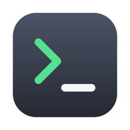

<div align="center">

<h1>Termora</h1>
<p><strong>SSH connections, tunnels and files in one encrypted document.</strong></p>
<p>
<a href="https://github.com/fballiano/termora/releases/latest"></a>
<a href="https://github.com/fballiano/termora/releases"></a>

<a href="LICENSE"></a>
</p>
<p><a href="https://github.com/fballiano/termora/releases/latest"></a></p>
</div>

<table align=center><tr><td align=center>
<strong>If you find my work valuable, please consider sponsoring</strong><br />
<a href="https://github.com/sponsors/fballiano" target=_blank title="Sponsor me on GitHub"></a>
<a href="https://www.buymeacoffee.com/fballiano" target=_blank title="Buy me a coffee"></a>
<a href="https://www.paypal.com/paypalme/fabrizioballiano" target=_blank title="Donate via PayPal"></a>
</td></tr></table>

---

Termora replaces Royal TSX for SSH work. It embeds the Ghostty terminal
engine through libghostty, and it drives the OpenSSH of macOS, so your
`~/.ssh/config`, your keys and your agent all work as they stand.

## Features

<table>
<tr><td><b>A bookmark tree</b></td><td>Folders pass credentials and settings down. A connection overrides only what it sets.</td></tr>
<tr><td><b>Your terminal</b></td><td>The Ghostty engine reads your own Ghostty configuration, so a pane looks like your terminal.</td></tr>
<tr><td><b>One connection</b></td><td>One control master carries every pane, every tunnel and the file browser. Nothing authenticates twice.</td></tr>
<tr><td><b>Tabs and splits</b></td><td>Tabs live in the title bar. ⌘D splits right, ⇧⌘D splits down, ⌘1…⌘9 switch, ⌥⌘← and ⌥⌘→ walk.</td></tr>
<tr><td><b>Live tunnels</b></td><td>Local, remote and SOCKS. A switch opens or closes a tunnel on an open connection, with no reconnect.</td></tr>
<tr><td><b>A file browser</b></td><td>This Mac on the left, the far host on the right. Drag both ways, with Finder file promises.</td></tr>
<tr><td><b>One encrypted file</b></td><td>AES-256-GCM behind a master password. Put it wherever you sync your files.</td></tr>
<tr><td><b>Touch ID</b></td><td>The key can rest in the Secure Enclave, so unlock is one touch. The password still works anywhere.</td></tr>
<tr><td><b>Royal TSX import</b></td><td>Folders, connections, tasks and saved passwords come across, with a report of everything that did not.</td></tr>
<tr><td><b>Agent ready</b></td><td>A bundled <code>termora</code> CLI lets a script or an AI agent list bookmarks and run commands over your connections. No secret ever reaches the tool.</td></tr>
</table>

## Install

With [Homebrew](https://brew.sh):

```bash
brew tap fballiano/termora https://github.com/fballiano/termora
brew trust --cask fballiano/termora/termora
brew install --cask fballiano/termora/termora
```

The URL is part of the first command, because this repository is the tap
itself. Homebrew 6 refuses a cask from a tap outside `Homebrew/*` until you
trust it, so the second command is also necessary. The full name in the
third command matters too: a different application also called “termora”
exists in the main cask repository.

Or download the zip from the
[latest release](https://github.com/fballiano/termora/releases/latest) and
drag **Termora** into **Applications**.

> [!IMPORTANT]
> The application is signed ad hoc, not with an Apple Developer ID, so macOS
> blocks the first launch. Open **System Settings → Privacy & Security** and
> select **Open Anyway**, or clear the mark from a terminal:
>
> ```bash
> xattr -dr com.apple.quarantine /Applications/Termora.app
> ```

| Item | Value |
| --- | --- |
| macOS | 26.0 or later |
| Hardware | Apple silicon |

A push of a tag `v*` builds the application from GitHub Actions, publishes
the release, and points the Homebrew cask at it.

## Requirements to build

- macOS 26 or later
- Xcode 26 or later
- XcodeGen (`brew install xcodegen`)

## Build

```sh
xcodegen generate
open Termora.xcodeproj
```

Or from the command line:

```sh
xcodegen generate
xcodebuild -project Termora.xcodeproj -scheme Termora \
           -configuration Debug -derivedDataPath build build
open build/Build/Products/Debug/Termora.app
```

`Termora.xcodeproj` is generated. Do not edit it. Change `project.yml`
and run `xcodegen generate` again.

## Layout

| Path | Purpose |
|---|---|
| `Termora/Terminal` | The only code that calls libghostty |
| `Termora/UI` | Sidebar, tabs, splits, inspector |
| `Packages/TermoraModel` | The object tree and folder inheritance |
| `Packages/TermoraVault` | The encrypted document and the Touch ID cache |
| `Packages/TermoraSSH` | The control master, the askpass service, and tunnels |
| `Packages/TermoraImport` | The Royal TSX reader and the AppleScript bridge |
| `Packages/TermoraSFTP` | The SFTP version 3 client and the file browser model |
| `TermoraUITests` | Tests that drive the real application |
| `Tools/` | The `termora-askpass` helper |

## Terminal configuration

Termora reads your own Ghostty configuration file, so a pane looks exactly
like your normal Ghostty window. It looks in this order:

1. `$XDG_CONFIG_HOME/ghostty/config`
2. `~/.config/ghostty/config`
3. `~/Library/Application Support/com.mitchellh.ghostty/config`

Termora never writes to that file.

Termora applies no colours of its own. The package it uses would otherwise put
its own theme over everything, and a pane would look nothing like the Ghostty
window you use every day. See `GhosttyEnvironment`.

## The document

Termora keeps everything in one file, for example `Connections.termora`.
Put that file wherever you sync your files.

```
"TERMORA1"        8 bytes
header length     4 bytes, big-endian
header            JSON: format version, cipher, key derivation parameters
body              AES-256-GCM: nonce, ciphertext, tag
```

The header stays readable so that Termora can find the key derivation
parameters before it asks you for a password. Everything else, including every
host name, is inside the sealed body. The header travels as additional
authenticated data, so a change to the salt or to the round count breaks the
seal instead of passing unnoticed.

The master password becomes the key through PBKDF2-HMAC-SHA512 with 600000
rounds, which takes about 0.44 seconds on Apple silicon.

Termora can also keep the derived key in the login Keychain behind Touch ID.
That is only a convenience. The file still opens with the master password on
any machine.

## Tests

```sh
(cd Packages/TermoraModel && swift test)
(cd Packages/TermoraVault && swift test)
xcodebuild -project Termora.xcodeproj -scheme Termora \
           -destination 'platform=macOS,arch=arm64' -derivedDataPath build test
```

The UI tests write a document with the vault API, then start the application
with `-TermoraLastDocumentPath <path>`. `UserDefaults` reads `-key value`
pairs from the command line, so the application needs no test-only code.

The SSH tests start their own OpenSSH server on a high port, in its own
directory, and build `termora-askpass` from source. They read and write
nothing in your `~/.ssh`. They are skipped when `/usr/sbin/sshd` is missing.

The SFTP tests talk to `/usr/libexec/sftp-server`, which macOS ships. It is
the same program OpenSSH runs for the `sftp` subsystem, so the protocol is
real, with no network and no keys. Each test works inside its own temporary
folder and removes it afterwards.

The import tests also run against a real Royal TSX document when one is
present. They read it and never write it, and they check counts and shapes
only: no host name, no user name, and no secret is printed. Set
`TERMORA_ROYAL_DOCUMENT` to point at your own file. The suite is skipped when
no document is found.

## How a connection works

Termora never speaks the SSH protocol. It drives `/usr/bin/ssh`, so it
inherits `~/.ssh/config`, certificates, FIDO keys, agent support, and
`known_hosts` without repeating any of it.

One control master carries the whole connection:

```
ssh -M -N -T -S <socket> …          authenticates once
ssh -S <socket> -o ControlMaster=no <host>          a terminal pane
ssh -S <socket> -o ControlMaster=no <host> -s sftp  the SFTP channel
ssh -S <socket> -O forward -L …     a tunnel, added while connected
ssh -S <socket> -O exit             closes everything
```

The master is separate from every pane, so you can close all the panes and
keep the connection and its tunnels alive.

### Tunnels

A connection carries a list of tunnels: local, remote, or dynamic (SOCKS).
You edit them in the inspector.

While the connection is closed, a checkbox decides whether a tunnel opens with
it. While the connection is open, the checkbox becomes a switch that opens or
closes that one tunnel at once. Nothing reconnects, because OpenSSH changes a
tunnel on the control socket.

Every row says in words what the tunnel does, for example
`localhost:8080 → localhost:80`, so two ports the wrong way round are visible
before you connect. A port OpenSSH would refuse, and two tunnels that listen on
the same port, are both reported in the inspector rather than at connection
time.

### The bookmark tree

A double click on a connection opens it. A right click offers the rest:
connect, browse files, edit, duplicate, delete. The editor appears as a sheet
over the window rather than a panel beside it, so the terminal keeps the room.

### Files

**Session, Browse Files** opens a file browser in its own tab. It has two
panes: this Mac on the left, the far host on the right. A copy is a drag from
one side to the other.

It travels on
the same control master as the terminal panes, so nothing authenticates twice,
and closing the browser leaves every pane alone.

Termora speaks SFTP version 3 itself, on the channel that
`ssh … -s sftp` opens. There is no second process, no second password, and no
cryptography in Termora.

The browser lists, opens folders, renames, makes folders, deletes, and copies
in both directions with a progress bar.

A folder is copied with everything inside it, in either direction. Termora
counts the whole tree first, so one progress bar runs from start to finish
instead of restarting at every file. A symbolic link is left out rather than
followed, so a link that points at its own parent cannot make the copy run for
ever, and the count of skipped links is reported when the copy ends.

Drag works both ways, and with any number of rows at once. Drag files or
folders from Finder onto the list to copy them into the folder on screen. Drag
a selection out of the list to copy it to Finder.

Nothing is copied while you drag. Finder receives one file promise per row and
asks for each item only when you let go, so dragging a large folder about costs
nothing until you mean it.

The list is an `NSTableView` rather than a SwiftUI `Table`, for that one
reason: only AppKit can hand Finder an `NSFilePromiseProvider` for every
selected row. See `Termora/UI/RemoteFileTable.swift`. The decisions that each
promise needs live in `SFTPPromise`, apart from AppKit, so they can be tested.

### How a password reaches OpenSSH

A secret never appears in a command line, in the environment, or in a file.
Termora sets `SSH_ASKPASS` to `termora-askpass` and `SSH_ASKPASS_REQUIRE` to
`force`, which sends every question to the helper even when a terminal is
present. The helper holds no secret: it passes the prompt to Termora over a
Unix socket in a private directory, together with a random token for that one
connection attempt, and prints the answer it receives.

`Tools/termora-askpass/main.swift` and
`Packages/TermoraSSH/Sources/TermoraSSH/AskpassClient.swift` are compiled into
both the helper and the library, so the tool and the tests can never speak
different versions of the protocol.

## Driving Termora from an agent or a script

The application bundle carries a small command-line tool, `termora`. It lets
a script or an AI agent use your bookmarks and your open connections, and it
never sees a password: it sends one request to the running application over
a private Unix socket, and the application does the rest.

A Homebrew install puts the command on your PATH as `termora`. Without
Homebrew, `./run.sh --install` links it into `/usr/local/bin`, or you can
call the binary in the bundle directly:
`/Applications/Termora.app/Contents/MacOS/termora-cli`.

```bash
termora list                  # every bookmark, one per line
termora status                # every open connection: name, state, tunnels
termora run web1 -- uptime    # run a command on a bookmark
```

`run` opens the connection when it is closed, through the same path as a
double click: the askpass sheet appears in Termora when OpenSSH must ask,
and the tool waits. The command then rides the control master, output
streams through as it arrives, and the far exit code becomes the exit code
of `termora`. Output is data only, one line per item, so it reads well from
a script and costs an agent few tokens.

The socket answers only while a document is open. Locking the document stops
the service, so a locked document gives away nothing, not even the names.
Exit code 2 means the application is not running, the document is locked, or
the request was refused; the reason is one line on standard error.

One line for a project `CLAUDE.md`:

```
`termora run <bookmark> -- <command…>` runs a command on a saved SSH server; `termora list` names the bookmarks.
```

## Importing from Royal TSX

**File, Import from Royal TSX…** reads an `.rtsz` document and adds its folders
and connections to the document you have open. Nothing already in the document
is removed.

A Royal document is a flat list of typed objects joined by `ParentID`, and the
importer keeps that shape: a connection that took its credentials from a folder
in Royal still inherits them in Termora.

### Passwords

Royal TSX encrypts `CredentialPassword` and `CredentialPassphrase` with a
scheme it does not publish. Termora does not guess at it. It asks Royal TSX
instead: the application has an AppleScript command, `get property value`, that
returns the decrypted value. macOS asks you once for permission to control
Royal TSX.

This route is proved against the real document: Royal TSX handed over all 12
stored secrets, 11 passwords and 1 key passphrase, with none empty.

If Royal TSX is missing, refuses, or is not installed, the import still runs.
The report then names every entry whose password you must type in.

Royal TSX needs about two seconds after it opens a document before it answers.
`RoyalTSXBridge.openDocument(path:)` waits inside the script, so the
application is idle rather than busy while the time passes.

`RoyalTSXBridge` is bound to the main actor. `NSAppleScript` needs the main
thread and a run loop: called from anywhere else it does not fail, it never
returns. Binding the type turns that hang into a compiler error.

The first time you import, macOS asks whether Termora may control Royal TSX.
Answer yes, or the report will list every password for you to type in.

To exercise the bridge against your own document and the real application:

```sh
cd Packages/TermoraImport
TERMORA_TEST_ROYAL_BRIDGE=1 swift test --filter RoyalBridgeLiveTests
```

That suite starts Royal TSX, so it stays off unless you ask for it.

### What the report tells you

Nothing is dropped without a word. The report lists:

- entries that were not imported, and why, such as Telnet, a serial port, or
  an entry in the Royal TSX trash;
- entries whose password Royal TSX did not hand over;
- settings Termora does not hold.

### Key sequences and tasks

Royal writes the text of a key sequence into the entry itself, so it comes
across as it stands, in the same form: `cd /opt/maho/app{ENTER}`. Termora types
it into the session once the prompt appears. `{ENTER}`, `{TAB}`, `{ESC}`, the
arrow names, and `{DELAY:500}` all work, and a name nobody knows is typed as
written rather than swallowed.

A sequence that Royal had switched off stays off, and its text goes into the
notes so nothing is lost.

A **task**, and a key sequence stored by name, cannot come across. Royal keeps
those in a different document, and only the name reaches the connections file.
The report names each one and says why.

### One entry, one method

Royal lets an entry carry a private key **and** a password at once. A Termora
connection uses one method, so the import sheet asks which one to keep. Keeping
the password is the default, because a key path is not a secret and you can
type it in again, while a password cannot be recovered. Either way, the report
names every entry this touched and the value that was left out.

## Known toolchain problem

Swift 6.3.3 crashes while generating code when a method reference is passed
straight to a `Binding` setter, as in `set: change`. Write the closure out:
`set: { newValue in change(to: newValue) }`. See `AuthenticationEditor` in
`Termora/UI/InspectorView.swift`.

## Two traps worth remembering

**A UI test target must not link a package that the application links.**
Adding `TermoraSSH` to `TermoraUITests` stopped the application under test
from opening any window at all, with no error anywhere. The test bundle only
needs the packages it imports itself.

**OpenSSH ends its lines with a carriage return and a line feed, and Swift
counts that pair as one Character.** `split(separator: "\n")` therefore finds
nothing and returns the whole log as one line. Use
`split(whereSeparator: \.isNewline)`. See `CommandResult.lines(of:)`.

## Status

- **Phase 1, done.** One Ghostty pane running your login shell.
- **Phase 2, done.** The object tree, folder inheritance, the encrypted
  document, the sidebar, and the inspector.
- **Phase 3, done.** The control master, `termora-askpass`, terminal tabs, and
  splits. Proved against a real OpenSSH server that the tests start themselves.
- **Phase 4, done.** The Royal TSX reader, the AppleScript bridge for saved
  passwords, and the import report.
- **Phase 5, done.** Tunnels in the inspector, with live control on an open
  connection. Local, remote, and SOCKS are each proved against a real server.
- **Phase 6, done.** The SFTP version 3 client and the file browser, proved
  against a real SFTP server and over a real SSH connection.

### Not done yet

- Resuming a transfer that was interrupted.

### Tasks from Royal TSX

Royal TSX calls a local command a task. A connections document never holds the
commands of a task: it holds only a name or an identifier. The commands live in
`~/Library/Application Support/Royal TSX/UserPreferences.config`, which is the
same `RTSZDocument` XML, so `RoyalDocumentParser` reads it as it stands.
`RoyalTaskLibrary` picks the `RoyalCommandTask` objects out of it, and the
importer joins them to `PreConnectTaskName` and `PreConnectTaskId`.

A task becomes `NodeSettings.beforeConnect`. It is inheritable, so a task set on
a Royal folder still reaches every connection in that folder. Termora runs it
before it starts the control master, and shows what it prints.

Two rules the importer keeps:

- A task that puts `$PASSWORD$` on its command line is refused. A command line
  is readable by every process on this Mac.
- Termora does not call a shell. `LocalCommandRunner.arguments(from:)` splits
  the argument line itself, so a mark such as `;` in a host name stays one word.

A task run after disconnecting is reported, not run. Termora has no such step.

### The terminal theme

libghostty reads your own `config` file, but it cannot resolve a
`theme = <name>` line: Ghostty loads theme files from its own application
bundle, and Termora is a different bundle. `GhosttyConfigFile.themeChoice(in:)`
reads that line, and `GhosttyEnvironment.userTheme()` finds the theme in the
catalogue that ships with `libghostty-spm`. Both the single form and the
`light:One,dark:Two` form work.

Do not pass an empty `TerminalTheme()`: the package then puts its own colours
over everything, and a pane looks nothing like your Ghostty window.

### The application icon

The icon is the Tabler `terminal` icon, drawn on the macOS rounded square.
`Tools/make-app-icon.swift` draws it with CoreGraphics and writes every size:

    swift Tools/make-app-icon.swift Termora/Resources/Assets.xcassets/AppIcon.appiconset

ImageMagick cannot render the source SVG: its built-in renderer drops strokes
and gradients.

### Touch ID without a signing identity

A Keychain item guarded by Touch ID needs the `keychain-access-groups`
entitlement. macOS only accepts that entitlement from a build signed with a
real team identity. With an ad-hoc signature every such call returns
`errSecMissingEntitlement` (-34018), and signing the entitlement anyway makes
macOS end the process at launch (exit 137). Both were measured, not guessed.

`VaultKeyStore` therefore does not use the Keychain. It asks the Secure
Enclave, which has no such rule, for a key that only Touch ID can use:

1. The Secure Enclave makes a private key guarded by `.biometryCurrentSet`.
   Its `dataRepresentation` is a sealed record that is useless anywhere else,
   so Termora keeps it in a plain file.
2. Termora makes a second key pair, agrees a shared secret with the Secure
   Enclave public key through ECDH, and drops its own private half.
3. The document key is sealed with a key derived from that secret (HKDF over
   the document salt).

Only the Secure Enclave can agree the secret again, and it asks for Touch ID
first. Records live in `~/Library/Application Support/Termora/TouchID`, one
file per document and salt, mode 0600.

Remembering a key reports its failure to the person. A quiet failure looks
exactly like success until the next launch asks for the password again.

### Never take a terminal tab out of the view tree

The tab area draws **every** tab in a `ZStack` and makes the hidden ones clear
with `opacity(0)`. The obvious form is wrong:

    if let tab = sessions.selectedTab { TabContent(tab: tab).id(tab.id) }   // WRONG

That takes the previous tab out of the view tree, which ends its
`TerminalSurfaceView`. libghostty cannot give the same terminal state a second
surface, so the tab stays blank for ever, even after you return to it. Every
tab you switch away from is lost, while the tab bar still reports it as ready.

`SessionsController.updateVisibility()` sets `isSurfaceVisible` so libghostty
stops drawing a tab you cannot see. That is the right way to save the work:
stop the drawing, keep the view.

### A task runs with the PATH of a login shell

A program started from the Dock inherits the small `PATH` that `launchd` sets,
usually `/usr/bin:/bin:/usr/sbin:/sbin`. A Royal task expects a terminal's
`PATH`. `LocalCommandRunner.loginPath` asks `$SHELL -lc 'printf %s "$PATH"'`
once, with a fixed command that carries no value from any document.

`programPath(for:searching:)` then finds a program named without a path, the
way a shell does. Royal's own `Ping` task names `ping`, which lives in `/sbin`
on a Mac, so without the search it would fail too.

### Termora carries its own copy of libghostty-spm

`Packages/GhosttyKit` is a copy of `Lakr233/libghostty-spm` at Ghostty 1.3.1.
The binary framework still comes from the upstream release by URL and checksum,
so only the Swift wrapper is ours. `Packages/GhosttyKit/FORK.md` says exactly
what was changed and why. **Read it before taking a newer upstream version.**

The wrapper kept **one** wakeup handler on the controller that every surface
shares. A new surface wrote over it, and closing any surface cleared it, so no
surface was told to draw. With one terminal open nothing looks wrong. With
tabs, a tab stays open, stays connected, and draws nothing, while the tab bar
still reports it ready.

The controller now keeps a set of observers: it ticks while **any** surface
wants it, and then tells **every** surface.
